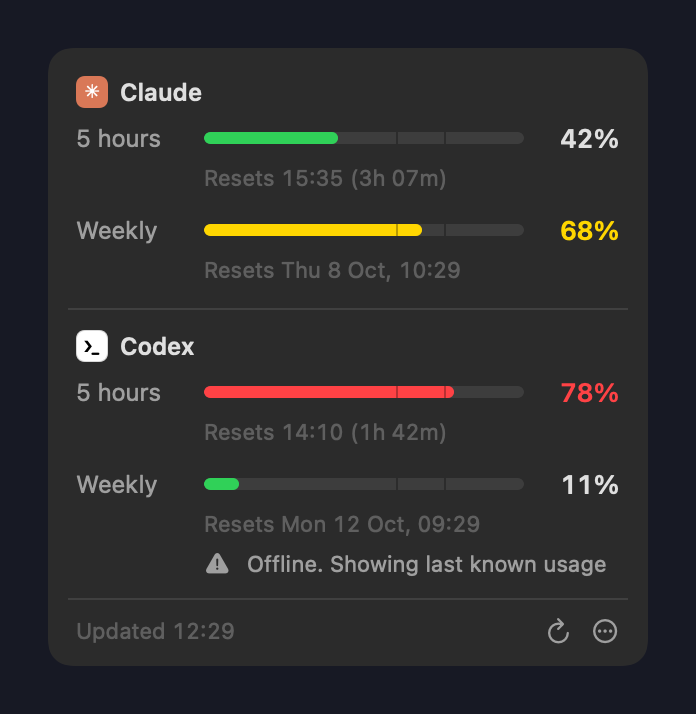
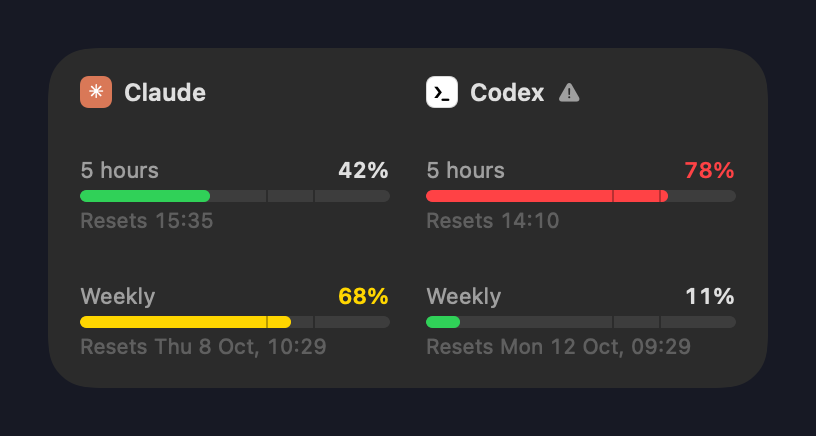

# AI Usage

A small menu-bar (macOS) and system-tray (Windows) app that shows how much of your **Claude** and **Codex**
usage you have left, for both the 5-hour window and the weekly limit. It warns you when you reach 75%.

<p>
  
  
</p>

- **Menu-bar / tray icon:** two tiny bars, Claude on top and Codex below, filled to the 5-hour usage.
- **Dashboard:** click the icon. For each AI you get a bar for the 5-hour window, with the exact reset time and a countdown, and a bar for the weekly limit, with the reset day and time.
- **Desktop widget:** medium (both AIs) or small (one per AI). Drag it anywhere. Turn it off from the ⋯ menu.
- **Colours:** green below 60%, yellow 60–75%, red from 75%.
- **Warning:** a system notification the first time a window reaches 75%, with the next reset time. It's sent once per window per reset cycle.
- **Refreshes** every 5–7 minutes, after the computer wakes, and when you open the dashboard.

macOS and Windows look and behave the same. Both are built from one design spec ([shared/DESIGN.md](shared/DESIGN.md)) and tested against one set of fixtures.

## Before you install

You need, on the same computer:

- **Claude:** [Claude Code](https://claude.com/claude-code) installed and signed in with a Claude subscription (Pro, Max, Team…). Run `claude` once and sign in.
- **Codex:** the [Codex CLI](https://github.com/openai/codex) signed in with your ChatGPT account (`codex login`).

You can use just one of them; the other shows a short "not signed in" note.

## Install

### macOS (14 Sonoma or later, Apple Silicon or Intel)

In Terminal:

```sh
curl -fsSL https://raw.githubusercontent.com/OWNER/REPO/main/macos/scripts/install-release.sh | zsh
```

This installs the latest release to `~/Applications` and starts it. It also starts automatically when you log in.

<details>
<summary>Or download it manually</summary>

1. Download **AI-Usage-macOS.zip** from [Releases](../../releases/latest) and unzip it.
2. Move **AI Usage** to Applications and open it.
3. macOS will say it can't verify the app (it isn't notarized by Apple). Open **System Settings → Privacy & Security**,
   scroll down and click **Open Anyway**. You only need to do this once.
</details>

On first launch, allow notifications when asked. If the bars don't show in the menu bar, they may be hidden behind the
notch: hold ⌘ and drag the menu-bar icons to make room.

### Windows (10 or 11, x64)

In PowerShell:

```powershell
irm https://raw.githubusercontent.com/OWNER/REPO/main/windows/install.ps1 | iex
```

This installs to `%LOCALAPPDATA%\Programs\AIUsage`, adds a Start menu shortcut, starts the app, and turns on start with Windows.

<details>
<summary>Or download it manually</summary>

1. Download **AI-Usage-Windows-x64.exe** from [Releases](../../releases/latest) and put it somewhere permanent (e.g. a folder in Documents).
2. Run it. If SmartScreen appears ("Windows protected your PC"), click **More info → Run anyway**. The app isn't code-signed.
</details>

Windows hides new tray icons at first. Click **^** next to the clock and drag the two-bar icon onto the taskbar to keep it visible.

## Uninstall

- **macOS:** quit from the ⋯ menu, delete `~/Applications/AI Usage.app`, and optionally run `defaults delete dev.aiusage.mac`.
- **Windows:**

  ```powershell
  & ([scriptblock]::Create((irm https://raw.githubusercontent.com/OWNER/REPO/main/windows/install.ps1))) -Uninstall
  ```

## Privacy

AI Usage runs entirely on your computer. It reads the login that Claude Code and the Codex CLI already saved, and sends it
**only** to Anthropic and OpenAI to ask for your usage, exactly like those tools do. It never refreshes, changes or uploads
your logins, has no server of its own, and collects no analytics.

- Claude: the macOS keychain item `Claude Code-credentials`, or `~/.claude/.credentials.json` (Windows: `%USERPROFILE%\.claude\.credentials.json`)
- Codex: `~/.codex/auth.json`, plus the CLI's local session logs as an offline fallback

## ⚠️ Disclaimer

**AI Usage is an unofficial, personal project.** It is not affiliated with, endorsed by, or supported by Anthropic or OpenAI.

- It reads usage from **undocumented** endpoints (`api.anthropic.com/api/oauth/usage` and `chatgpt.com/backend-api/wham/usage`),
  the same ones Claude Code and Codex use internally. They can change or disappear **without notice**. If that happens,
  the app keeps showing the last known values with a ⚠︎ until it's updated.
- Figures are for guidance only. The providers' own apps are the source of truth for your limits.
- You're responsible for complying with Anthropic's and OpenAI's terms for your account.
- The software is provided "as is", without warranty of any kind. See [LICENSE](LICENSE).

## Build from source

```
macos/     Swift / SwiftUI + AppKit app (Swift package)
windows/   C# / WPF app (.NET 10)
shared/    design spec + JSON fixtures both test suites run against
```

**macOS:** needs the Xcode Command Line Tools (`xcode-select --install`).

```sh
macos/scripts/install.sh            # build, install to ~/Applications, launch
cd macos && swift test              # with full Xcode; with Command Line Tools only, see below
```

With only the Command Line Tools, Swift Testing needs explicit paths:

```sh
F=/Library/Developer/CommandLineTools/Library/Developer/Frameworks
L=/Library/Developer/CommandLineTools/Library/Developer/usr/lib
swift test -Xswiftc -F -Xswiftc $F -Xlinker -F -Xlinker $F -Xlinker -rpath -Xlinker $F -Xlinker -rpath -Xlinker $L
```

**Windows:** needs the [.NET 10 SDK](https://dotnet.microsoft.com/download). The app runs only on Windows, but it builds and its tests run on any OS.

```sh
cd windows
dotnet test tests/AIUsage.Core.Tests
dotnet run --project src/AIUsage                      # run (Windows)
dotnet run --project tools/AIUsage.Probe              # print live usage with the Windows client (any OS)
dotnet publish src/AIUsage -c Release -r win-x64 --self-contained -p:PublishSingleFile=true -o publish
```

**Snapshots:** both apps render every surface to PNG, so you can compare the two looks:

```sh
macos/.build/debug/AIUsage --snapshot out --demo     # after `swift build` in macos/
AIUsage.exe --snapshot out --demo                    # Windows
```

CI uploads both sets as build artifacts.

**CI:** every push to any branch, and every pull request, runs both test suites on macOS and Windows,
builds both apps, and uploads demo snapshots of both as artifacts.

**Releasing is automatic.** Every push to `main` runs the same checks and then publishes a new version with
both installers attached. The version bumps like this:

| Pushed commits contain | Version bump |
|---|---|
| nothing special | patch: `1.0.3` → `1.0.4` |
| `#minor` | minor: `1.0.4` → `1.1.0` |
| `#major` | major: `1.1.0` → `2.0.0` |
| `[skip release]` (last commit) | tests only, no new version |

The first release is `1.0.0`. The version comes from the latest `vX.Y.Z` tag
([scripts/next-version.sh](scripts/next-version.sh)) and shows at the top of the ⋯ menu in both apps.
You can also release by hand: Actions → Release → Run workflow, then choose the bump.
The full cheat sheet is in [CONTRIBUTING.md](CONTRIBUTING.md).
Work on a branch and merge it into `main` when you want it shipped.

## License

[MIT](LICENSE)
